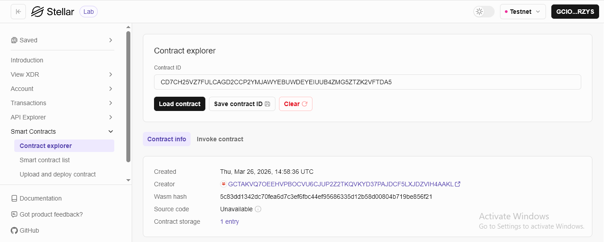

# Book Management Application

**Book Management Application** - Blockchain-Based Decentralized Book Management System

**Book Management Application Contract ID** - CD7CH25VZ7FULCAGD2CCP2YMJAWYEBUWDEYEIUUB4ZMG5ZTZK2VFTDA5

## Project Description

Book Management Application is a decentralized smart contract solution built on the Stellar blockchain using Soroban SDK. It provides a secure, immutable platform for managing book records directly on the blockchain. The contract ensures that your data is stored transparently and is only manageable through predefined smart contract functions, eliminating reliance on centralized database providers.

The system allows users to create, view, and delete book records, leveraging the efficiency and security of the Stellar network. Each book is uniquely identified and stored within the contract's instance storage, ensuring data persistence and reliability.

## Project Vision

Our vision is to revolutionize structured data management in the digital age by:

- **Decentralizing Data**: Moving book record management from centralized servers to a global, distributed blockchain
- **Ensuring Ownership**: Empowering users to have complete control and ownership over their stored data
- **Guaranteeing Immutability**: Providing a permanent, tamper-proof record of data that cannot be altered or deleted by third parties
- **Enhancing Transparency**: Leveraging blockchain to make all data operations verifiable
- **Building Trustless Systems**: Creating a platform where data integrity is guaranteed by code, not by centralized authorities

We envision a future where structured digital data is fully decentralized and owned by users.

## Key Features

### 1. **Structured Book Creation**

- Create book records with a single function call
- Specify title, content, author, and number of pages
- Automated ID generation for unique identification
- Persistent storage on the Stellar blockchain

### 2. **Efficient Data Retrieval**

- Fetch all stored book records in a single call
- Structured data representation for easy frontend integration
- Quick access to your entire dataset
- Real-time synchronization with the blockchain state

### 3. **Secure Deletion**

- Remove specific book records using their unique IDs
- Permanent removal from the contract storage
- Clean and efficient storage management
- Immediate update of the dataset after deletion

### 4. **Transparency and Security**

- View all data activities on the blockchain
- Blockchain-based verification of all storage actions
- Immutable records of creation and deletion
- Protected against unauthorized modifications

### 5. **Stellar Network Integration**

- Leverages the high speed and low cost of Stellar
- Built using the modern Soroban Smart Contract SDK
- Scalable architecture for growing datasets
- Interoperable with other Stellar-based services

### 6. **Book Update (Edit Feature)**

- Update existing book records using their unique ID
- Modify title, content, author, and page count
- Replaces the old data with new input
- Immediate update reflected in on-chain storage
- Maintains data consistency within the collection

## Contract Details

- Contract Address: CD7CH25VZ7FULCAGD2CCP2YMJAWYEBUWDEYEIUUB4ZMG5ZTZK2VFTDA5
  

## Future Scope

### Short-Term Enhancements

1. **Metadata Expansion**: Add fields such as genre, publisher, and publication year
2. **Validation Rules**: Ensure data consistency (e.g., pages > 0)
3. **Search Functionality**: Implement filtering by title or author
4. **Data Indexing**: Improve lookup efficiency

### Medium-Term Development

5. **Ownership System**: Associate book records with wallet addresses
   - Permission-based access
   - User-specific data filtering
   - Access control mechanisms
6. **Update Functionality**: Allow modification of existing records
7. **Asset Attachment**: Attach digital assets or references to books
8. **Inter-Contract Integration**: Allow other smart contracts to interact with stored data

### Long-Term Vision

9. **Cross-Chain Synchronization**: Extend data storage across multiple blockchain networks
10. **Decentralized UI Hosting**: Host frontend on IPFS or similar platforms
11. **AI Integration**: Summarization or classification of stored content
12. **Privacy Layers**: Zero-knowledge proofs for private data
13. **DAO Governance**: Community-driven feature development
14. **Identity Management**: Integration with decentralized identity (DID)

### Enterprise Features

15. **Digital Catalog Systems**: Library or archive management
16. **Immutable Records**: Permanent publication tracking
17. **Automated Reporting**: Trigger-based reporting systems
18. **Multi-Language Support**: Internationalization support

---

## Technical Requirements

- Soroban SDK
- Rust programming language
- Stellar blockchain network

## Getting Started

Deploy the smart contract to Stellar's Soroban network and interact with it using the main functions:

- `create_book(title, content, author, pages)` - Create a new book
- `get_books()` - Retrieve all stored books
- `update_book(id, title, content, author, pages)` - Update an existing book
- `delete_book(id)` - Remove a specific book by its ID

---

**Book Management Application** - Structuring Data on the Blockchain